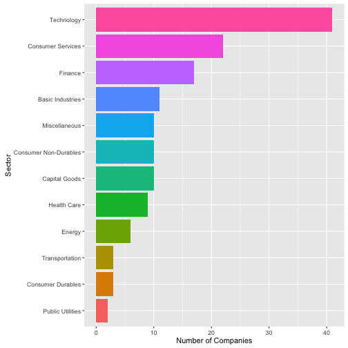
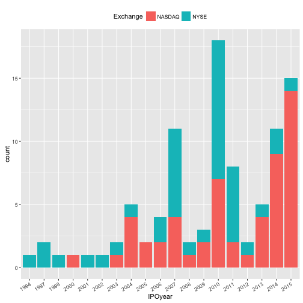
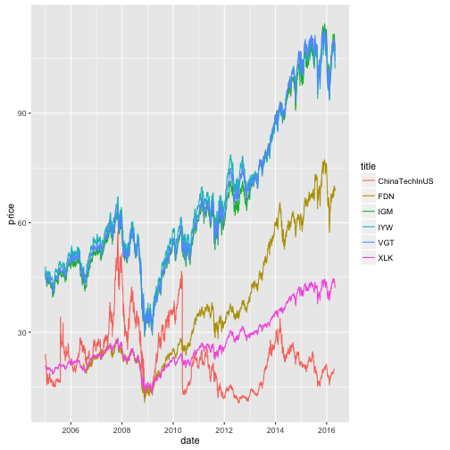

---
title       : Eat and Play Team
subtitle    : China Company US Stock Analysis
author      : Yi Li, Zhang Qin, Zhaoqin Ye
job         : 
framework   : io2012        # {io2012, html5slides, shower, dzslides, ...}
highlighter : highlight.js  # {highlight.js, prettify, highlight}
hitheme     : default      # 
widgets     : []            # {mathjax, quiz, bootstrap}
mode        : selfcontained # {standalone, draft}
knit        : slidify::knit2slides
--- 

--- &twocol
## Eat and Play Team: China Company US Stock Analysis

- question answered:
  - What are some patterns in the decomposition of China companies' US Stock
  - How do these stocks perform compared to US stocks
  - how do these stocks perform compared to Chinese domestic stocks

## Chinese company US stock decomposition
- dataset: NASDAQ, NYSE, AMEX exchanges stock listing (variables: symbol, sector, IPOyear, exchange)
*** =left

Technology dominates all other sectors

*** =right

NYSE has more in past, but NASDAQ increases greatly and exceeds NYSE in recent years

--- &twocol

## Performance against US stocks

- method learned in class: 
  - use XML library to scrape data table in HTML page
  - convert all history data to same tiny data format
  - process and mutate date variables in R
- dataset: 
  - Top technology ETFs listing (variables: symbol)
  - Yahoo Finance stock history price (variables: date, Close price)

*** =left

China company's stocks do not perform as well as US stocks in tech sector

*** =right

These three ETFs have very similar pattern compared to the average

--- &twocol

## Performance against Chinese domestic stocks
- method not in class: 
  - data scraping for non-html tables, using Scraper plugin in Chrome
  - deal with non-ASCII encoded data table information
  - clean HTML page for specific tag information as data input
- dataset:
  - Chinese stock listing by sector (variables: symbol, exchange, sector)
  - Yahoo Finance stock history price (variables: date, Close price)

*** =left

Follow very similar patterns, starting from 2014 domestic tech stocks tend to outperform foreign stocks due to China's tech boom

*** =right

ETFs follow similar pattern to domestic average, indicating domestic stock has some influence to foreign China stock price
